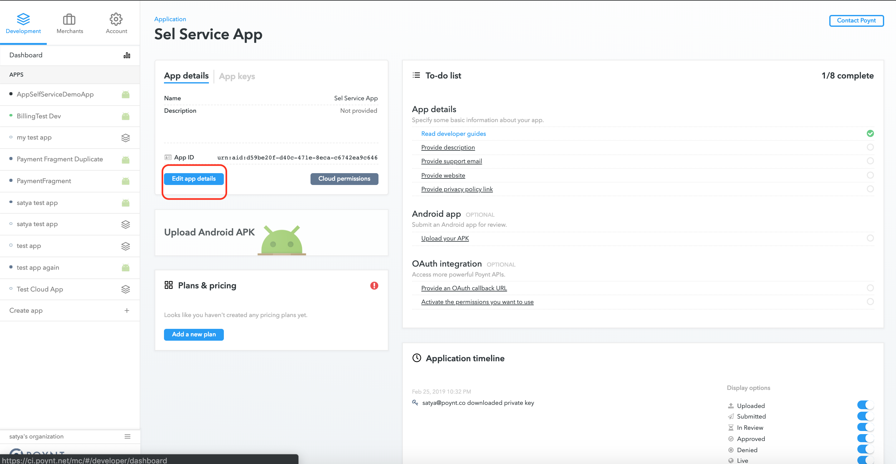
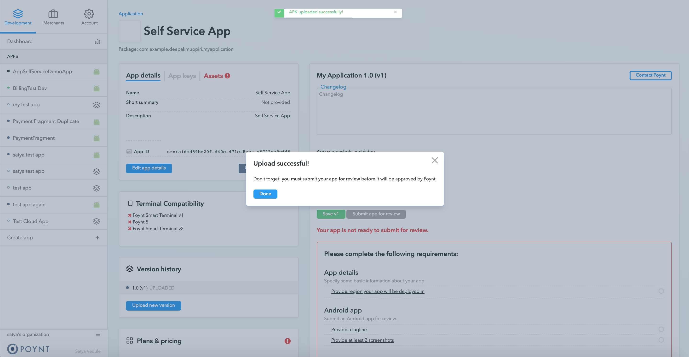
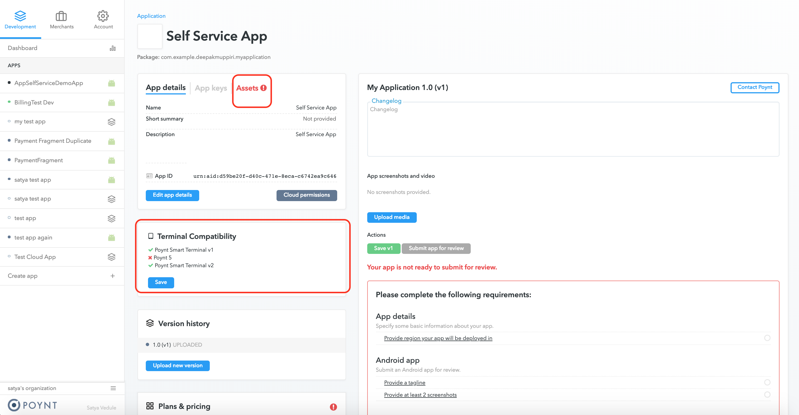
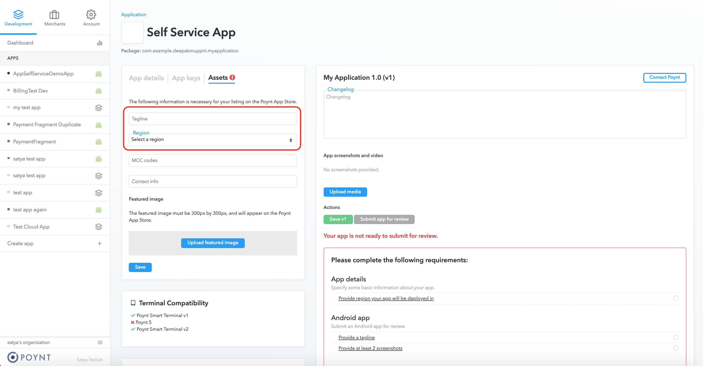
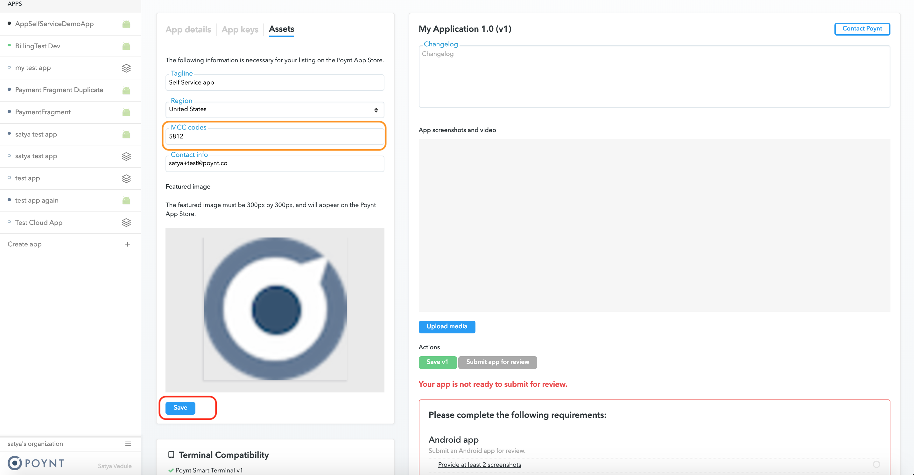
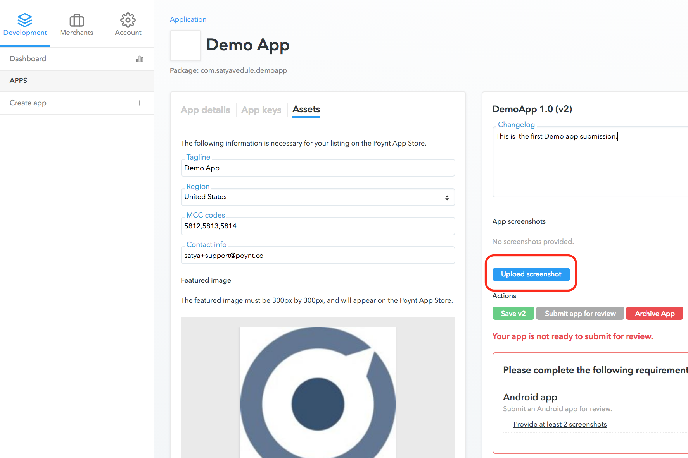
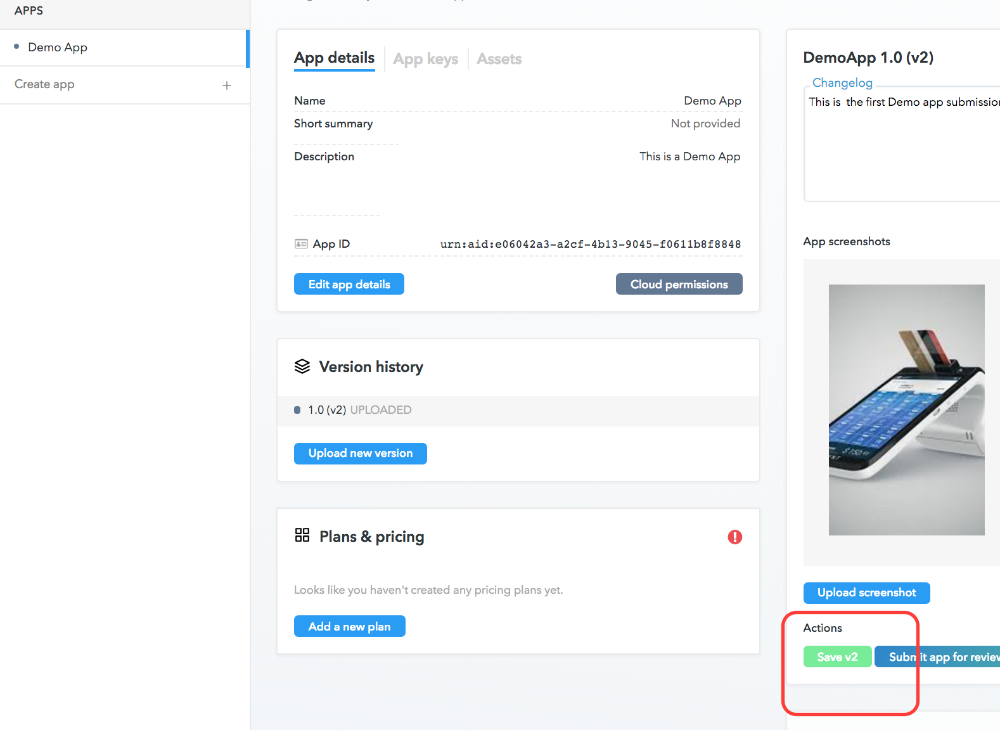
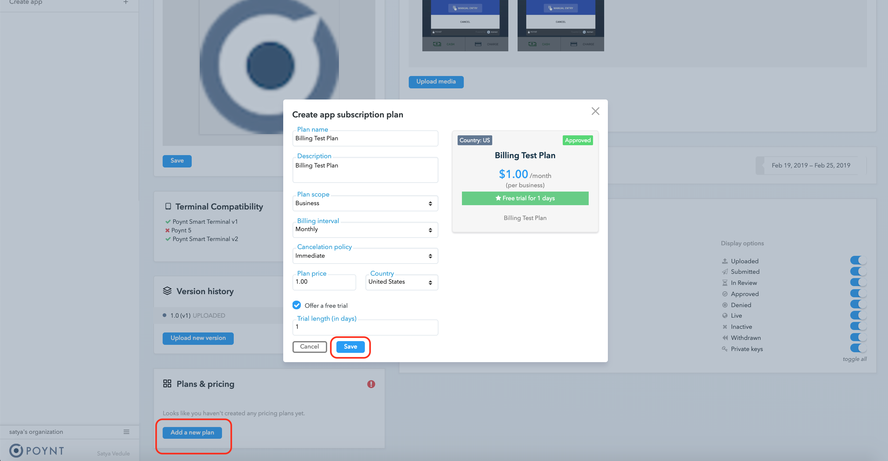
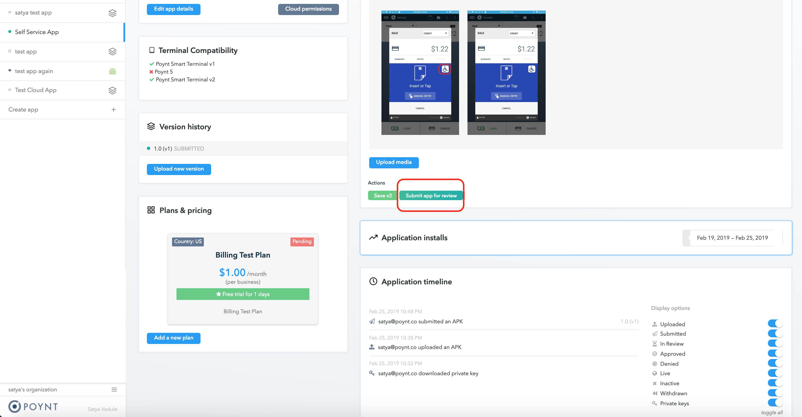
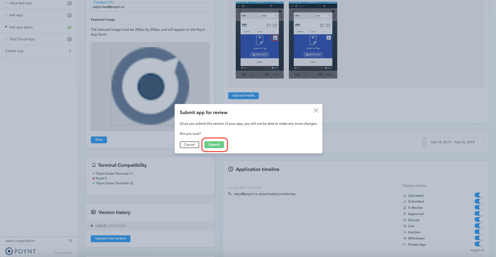

#### 1. <a href='../setup/activate-poynt-terminal.html#installation'>Create a New developer</a> account or Sign-In to your existing one

#### 2. Create an App

Enter the app name as you want it displayed in Poynt Store. 

#### 3. Download the Public-Private keypair
The private key is used to generate self-sign JWT required to obtain an access token. You need this key if you plan to use Poynt Cloud API.  

IMPORTANT! Poynt does not store your private key. If you lose your private key you will neeed to reset and download new key in Developer Portal.

#### 4. Go to App details

#### 5. Edit App details

If you need to reset your API private key, you can go to `App Keys` tab: 

#### 6. Upload an Apk
The package name of your app has to be unique in the Poynt Store. The best practice is to have the package name start with the domain name of your site (e.g. If you own domain name `awesomedeveloper.com` your apps package name should start with `com.awesomedeveloper`). Apps with package names starting with `co.poynt` or `com.poynt` will be rejected.

<strong>NOTE:</strong> Make sure that you are uploading a signed release version of your apk (If you are uploading a dev variant to test billing integration it can be signed by Android Studio debug key).

&nbsp;
 

<strong>WARNING:</strong> Make sure you <strong>don't lose the key</strong> used to sign your apk. If you do, you will not be able to push updates to merchants who use your app and will need to create a new app with a different package name

You are not done yet. Uploading your apk does not submit your app for review!

#### 7. Provide additional information needed for your app to be listed in Poynt Store

Select the terminal types that the app is compatible with under `Terminal Compatibility`.

* `Tagline` is a short description for your app when it's displayed as a recommended app. 
* `Region` determines in which country your app will be available

Based on the country you select you will be promted to accept the Distribution Agreement.

<strong>NOTE:</strong> MCCs, or Merchant category codes, classify businesses by what they sell or the service they provide. These four-digit codes are assigned by payment card organizations — Visa, MasterCard, American Express and Discover — when the business first starts accepting these methods of payment. Please provide the <strong>(MCC)</strong> codes of merchants (in a comma-delimited format) your app is best suited for. More information on <strong>(MCCs)</strong> codes can be found <a href="https://www.dm.usda.gov/procurement/card/card_x/mcc.pdf">here</a> 

If you are uploading a new version of your app provide the list of changes in the Change Log.

Upload a minimum of two screenshots (for best results use 800x1280px resolution). You can also upload a video (up to 10MB).

Save the submission.

<!-- 

 -->

<!--  -->

#### 8. Create Billing plans

<!--  -->

`Cancelation Policy` determines if the subscription will be canceled immediatey or will remain to be active until the end of the current billing cycle.

Save and submit the plan. Plan will be in Pending state until a Poynt analyst approves it.

#### 9. Submit the apk for Poynt Review

The app has now been successfully Submitted.

<!--  -->

&nbsp;

#### 10. <a name="BetaApps">Beta Apps:</a>

The apk is reviewed within 24 hrs. If all the checks pass, the apk status changes to IN-PILOT. The app is now available under the `Beta Apps` section of the app store on the terminal.

IMPORTANT! During the Pilot / Beta testing phase, the app can be installed on up to 10 devices for beta testing. As soon as the device limit is reached the app will not be displayed under the `Beta Apps` section of the app store.

If the apk is rejected, the rejection reasons are displayed for that version.

#### 11. Plan approval & Go-Live

If the app exits the Pilot phase successfully, Poynt review analyst will change Billing plan status from `Pending` to `Approved`.
The app is also set to `Live` status and the app made available on the app store.

<!-- ### <a name="WhatsNew">What's New:</a>
App Compatibility with different Terminal types can now be set for every apk upload.

If an App gets rejected, the rejection reasons are displayed for that apk version.

 -->
<!-- feedback widget -->

