

## Overview 

App Self-Service feature allows developers to push app apk updates to merchants who are beta testing their app. This eliminates the need to contact Poynt developer support each time they need to push an apk update, which may also require coordinating with the merchant to install the update outside of normal business hours to avoid any disruption.Therefore, this feature enables developers to be able to push such updates by themselves. 

## Solution 
Beta apps section will be exposed in Poynt Store (on the terminal) that will allow merchants to discover and download beta apps. Upon the download, merchant's terminal will be added to a beta app terminal group owned by the developer's organization. We will allow developers to see all live terminals (which are part of the beta app group) on the groups page and allow creating a job to do apk install and uninstall. Developers would not be able to access terminal timeline to prevent them from taking any other actions that could interfere with the normal operation of the merchant's terminal.

Below is an illustration of the App Self-Service flow:

#### 1. Switching from Developer Portal to Mission Control
Navigate to the Account section
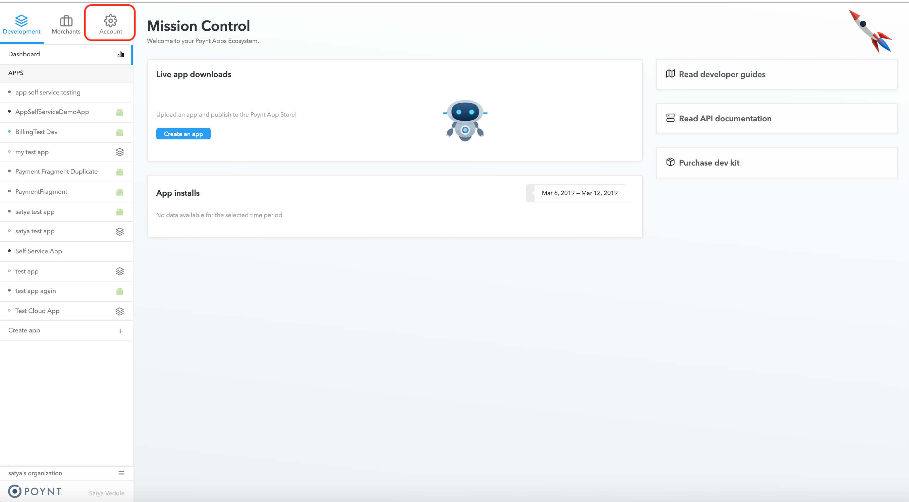

Click on `Mission Control` to switch views.  
If you do not see the `Mission Control` link, please contact `devsupport@poynt.co` for assistance.
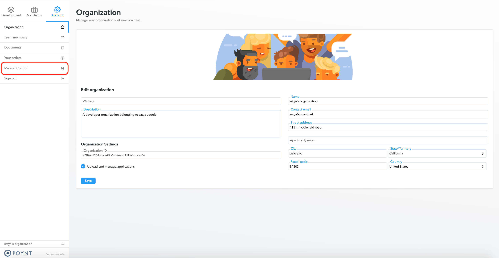

#### 2. Navigate to Terminal Groups
Go to Terminal->Groups from the menu and select the group. 

IMPORTANT! When a new apk is uploaded a terminal group is automatically created for beta testing.
The group is used to track terminals that have installed the app during beta testing phase. When an app is installed/uninstalled on a merchant terminal, serial number are added/removed from the beta testing terminal group 

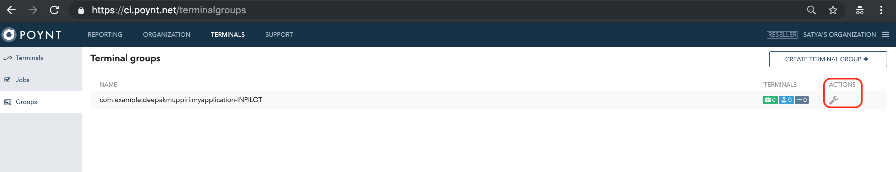
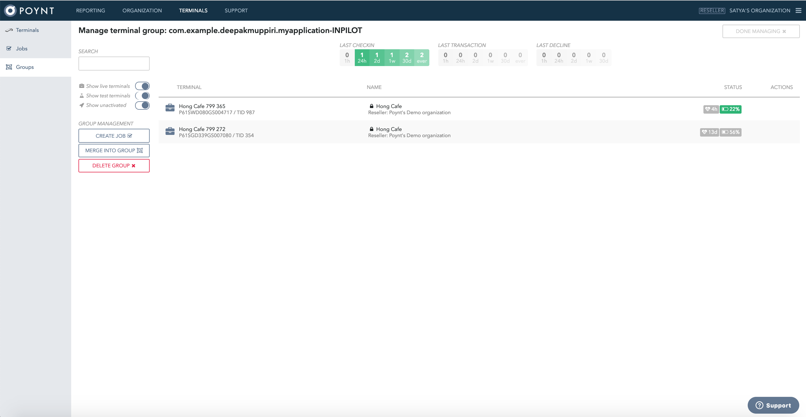
<!-- 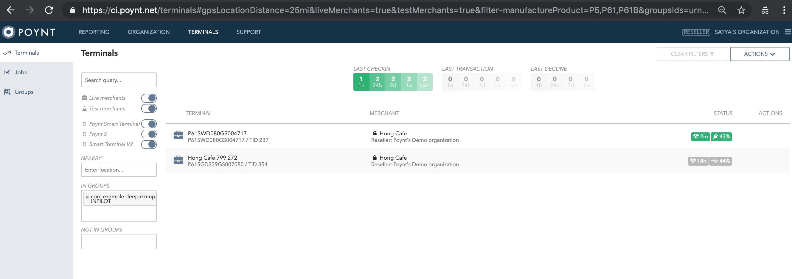 -->

#### 3. Create Jobs 
You may Install and Uninstall apps on terminals
<!--  -->
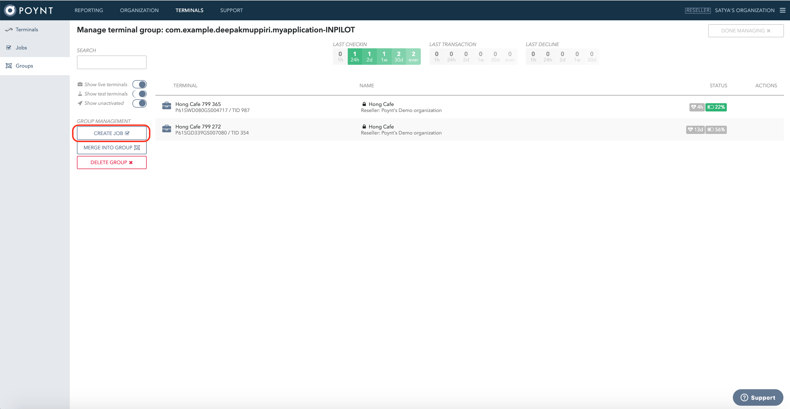
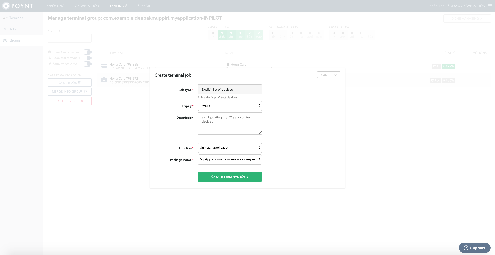
<!-- 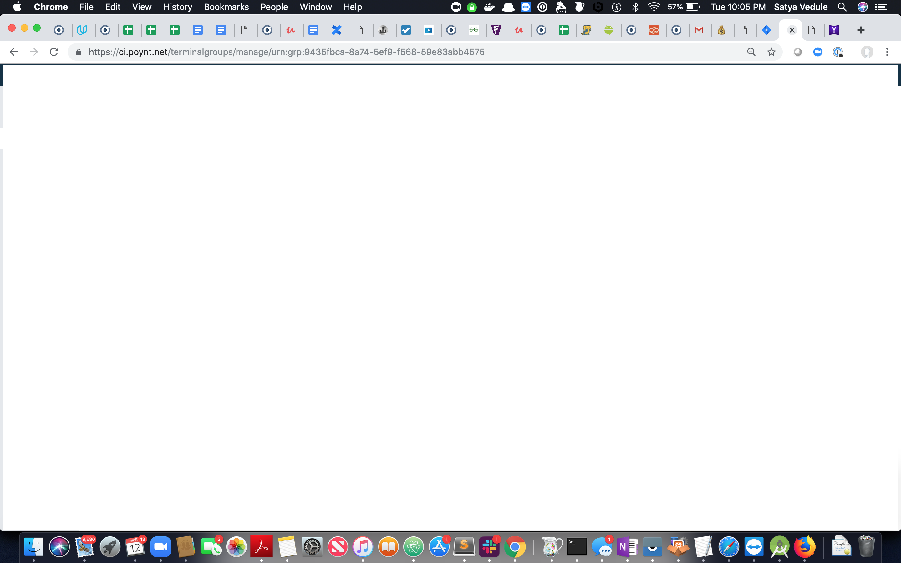 -->
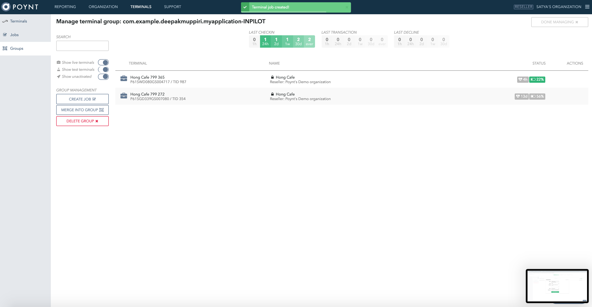

To create a job on specific terminals, use the terminal search box to filter on the required terminals(as comma-separated values).
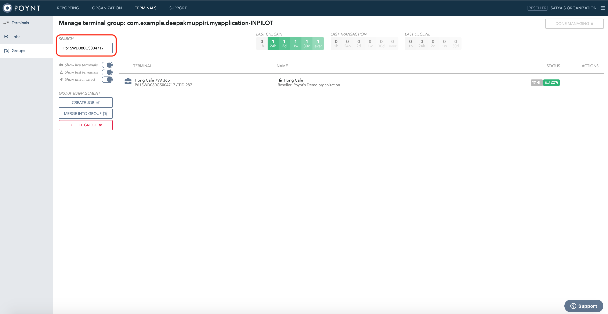

#### 4. Swithing back to Developer Portal
Click on the `Skip` button under the hamburger menu to go back to the Developer view.
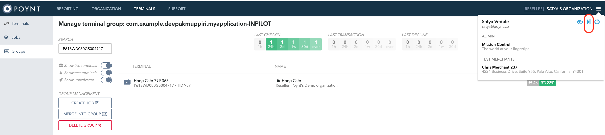

<!-- feedback widget -->

