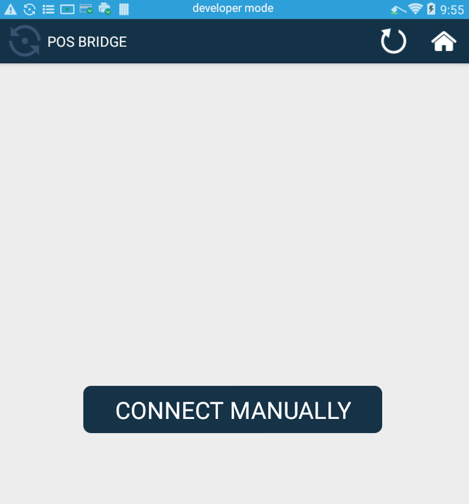
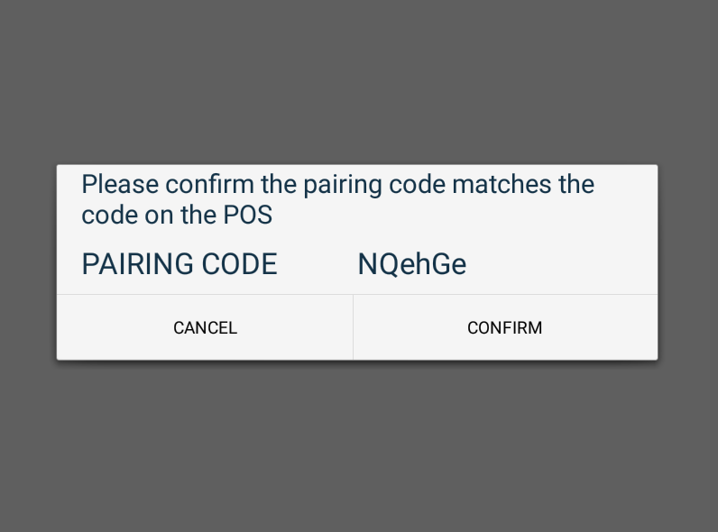
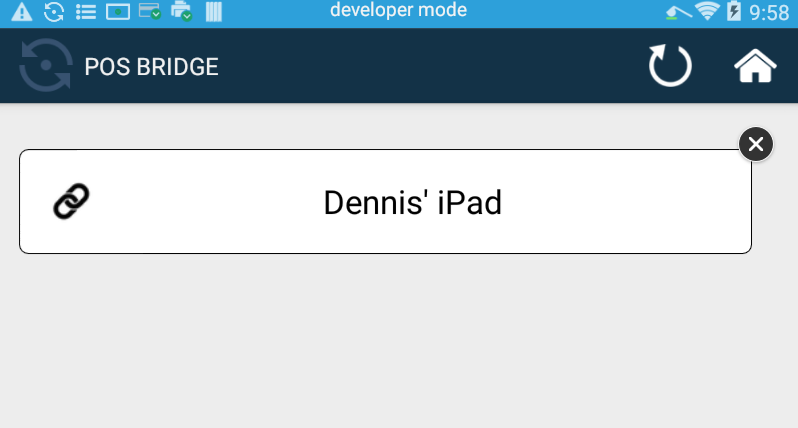
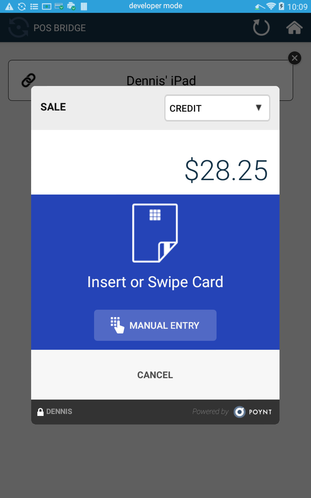

POS Bridge is an Android service that allows allows a point-of-sale application running on an external system (i.e. client) like an iPad or Windows PC to connect to the Poynt terminal over a local network connection (TCP port 55555) using [Poynt iOS SDK](https://github.com/poynt/pos-connector-ios-sdk-sample) or [Windows SDK](https://github.com/poynt/pos-connector-windows-sdk).

POS Bridge can be downloaded and installed from the the Poynt Store.

When POS Bridge app is launched it starts advertising its IP and port using [network service discovery](https://developer.android.com/training/connect-devices-wirelessly/nsd.html). **CONNECT MANUALLY** button can be used to display terminal's IP address and pairing code if the system connecting to the terminal does not support network service discovery.

{:width="600px"}

Once a pairing request is initiated by the client the POS Bridge will display a confirmation dialog:

{:width="600px"}

Note: the confirmation dialog timeout is set to 30 seconds.

&nbsp;

After the pairing request is confirmed the POS Bridge will display the name of the connected client. Pairing can be terminated by tapping on **X** button.

{:width="600px"}

POS Bridge will remain running in the background and does not need to be open to accept payment requests from the client.

{:width="600px"}

Note: At the moment the terminal can be paired with only one client (POS) using POS Bridge.

&nbsp;

<!-- feedback widget -->

