 * [Pont Smart Terminal Emulator Setup](#p61)
 * [Poynt 5 Emulator Setup](#p5)

## Poynt Smart Terminal Emulator

To help speed up your development and testing, we provide a developer-edition version of PoyntOS that can be run on an Android emulator
or directly on an Android Tablet (Tegra Note 7 is recommended, but any 7" tablet would work as long as you code for multi-screen resolution including tvdpi).
Note that certain functionality will not be available in the emulator (i.e. collecting consumer input from second screen, handling card payments, only manual credit entry supported, etc.);
however, the emulator will give you enough functionality to start building and testing your apps. You'll have access to the terminal application (key in
transactions), the register (catalog-driven point of sale app), transaction data, customer data, and more.

Activating a PoyntOS virtual device on a device emulator is just like activating a physical Poynt Smart Terminal. Lets get started!

### Prerequisites

* Android SDK with API level 19 (KitKat)
* A virtual device emulator (Android Studio AVD or Genymotion) or a 7” Android Tablet (Tegra Note 7 is recommended)
* Virtual devices need configured to screen size at 800x1280 (tvdpi)
* Python (for installation scripts)

### Download and install emulator
Download and unzip the PoyntOS emulator installer here: [PoyntOS\_Emulator\_Install.zip](https://poynt-emulator.s3.amazonaws.com/v1.2.26/PoyntOS_Emulator_Install.zip). Run the installation script `setup_poynt_os.py`

### Activating your virtual Poynt terminal
1. The first time you boot up your device you'll be asked to choose a launcher. Select `Setup Wizard` to start Poynt's OOBE ("out of box experience") application. NOTE: If you're using Genymotion, enable `Use virtual keyboard for text input` option in device configuration.
2. If after selecting Language you get a crash (SecurityException in logcat), just rerun the python installer script.
3. WiFi setup - select your SSID and WiFi credentials to connect.
4. Once connected, you'll be shown the device activation screen -- keep the device running, we'll get back to this shortly.
5. From your laptop/desktop, point your browser to the Poynt HQ Developer Portal: https://poynt.net/auth/signup/developer -- register to be a Poynt developer, or sign in if you already have.
6. After signing in, click `Create a Test Merchant` from the dashboard -- this will create a mock/test business for your development activity.
7. After creating a test merchant, click `Active a Poynt Terminal` from the dashboard.
8. A test terminal with the status `Needs activation` was created for you (in step 5 above) -- click the lightning bolt icon to activate the terminal. You'll see your activation credentials that you'll use to activate your virtual Poynt terminal.
9. Go back to your Poynt emulator terminal. If the camera is active and it's looking for a QR code, click `Don't have a QR code` link. Select the acquirer, and enter the MID and TID values from your browser (in step 7 above).
10. Once you activate the device, Poynt’s OOBE app disables itself.
11. Click on the `Home` icon in your device or emulator then select `Poynt Launcher` as the launcher (select `Always` option).

At this point, your device is setup with required services and applications so it can act as a Poynt Smart Terminal. Try launching the `Poynt Terminal` app and process a cash transaction to make sure everything is working as expected. If you encounter any errors, please refer to `adb logcat`.
This is very useful to pinpoint what's failing. If you do need any assistance, head over to the Poynt developer [discussion forums](https://discuss.poynt.net/c/developers), or reach out to our [support team](https://poynt.net/support).

<!-- feedback widget -->

## Poynt 5 Emulator

1) Open AVD Manager in Android Studio

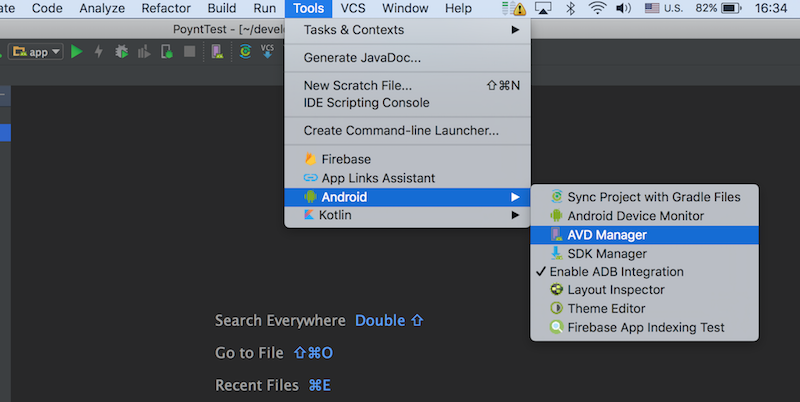

2) Click on **Create Virtual Device...** button

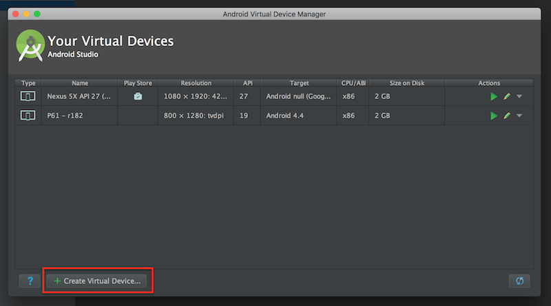

3) Click on **New Hardware Profile** button

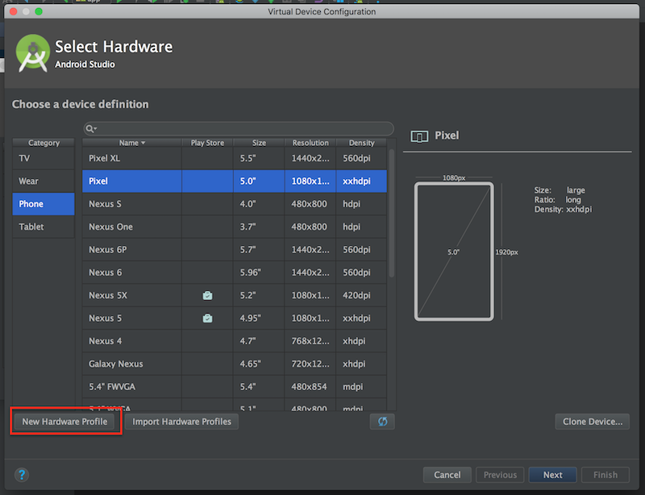

4) Set the device name, resolution 720x1280, RAM, Orientation and Camera options

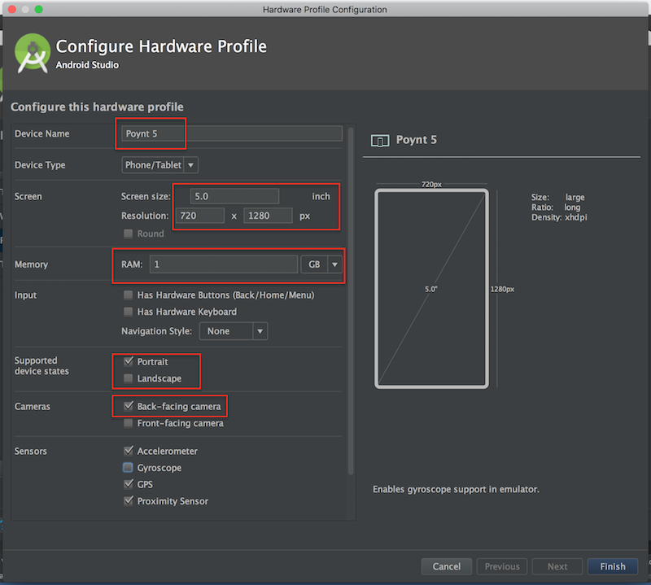

5) Select Marshmallow system image (without Google Play Services)

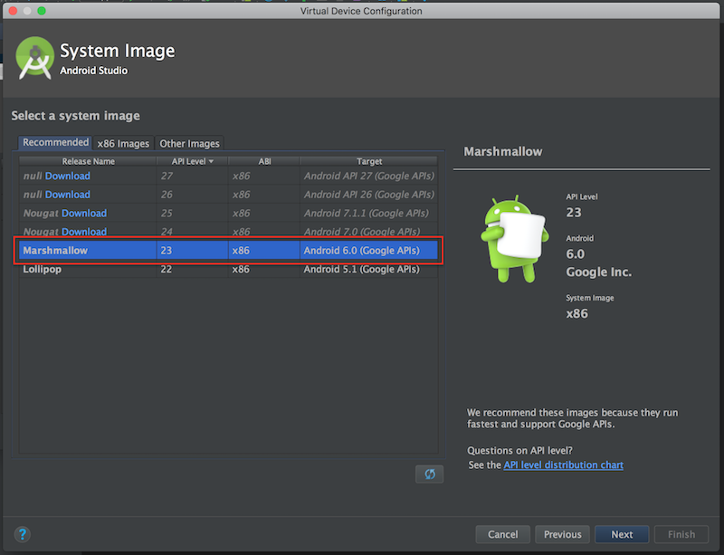

6) Click on **Finish** button

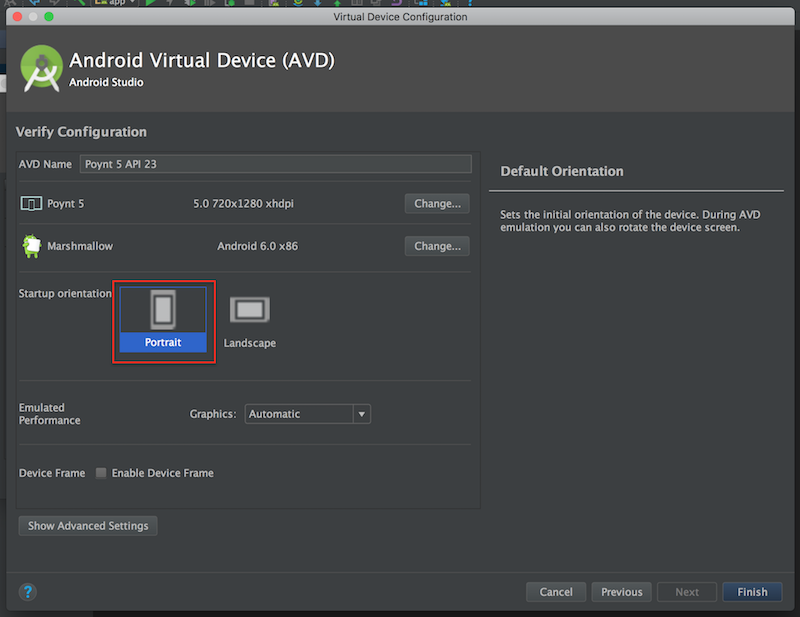

7) After that you should see a new virtual device "Poynt 5". Launch the virtual device you just created.

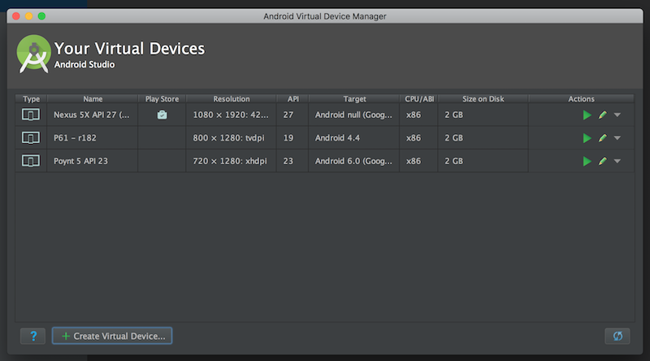

8) Download the [Poynt 5 emulator installer](https://poynt-emulator.s3.amazonaws.com/P5/p5-198.zip) and unzip the archive. Run the python installer script. After the installer finished running you should see the following screen:

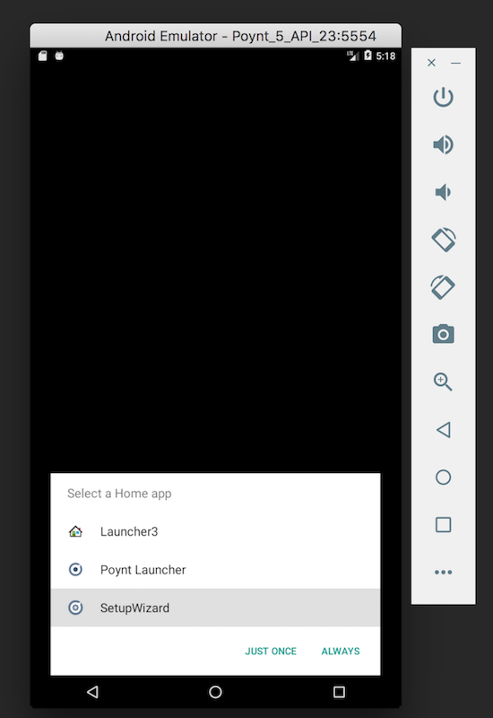

9) Select and run Setup Wizard

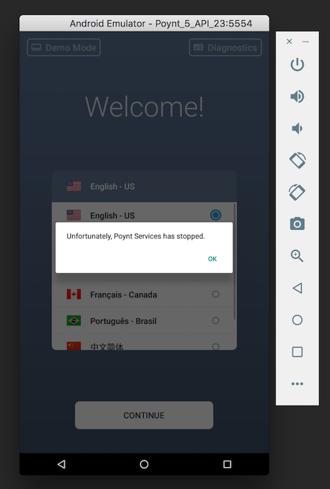

10) You may get "Poynt Services has stopped" warning but it can be ignored if in the logcat you see "No permission to write APN settings"

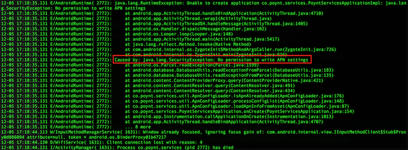

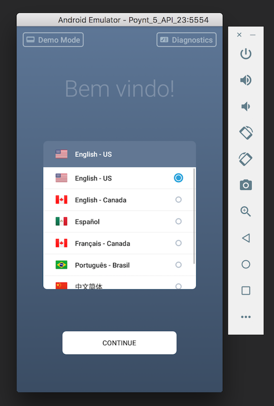

11) Click **Continue**

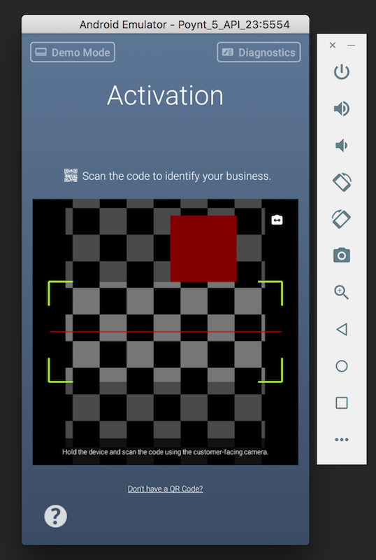

12) Click on **Don't have a QR Code?**

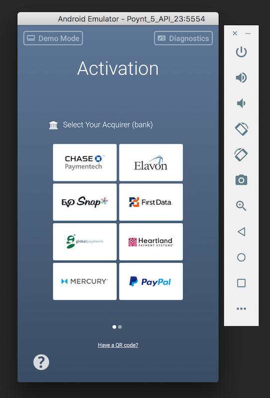

13) Select the a acquirer that matches your test merchant account configuration

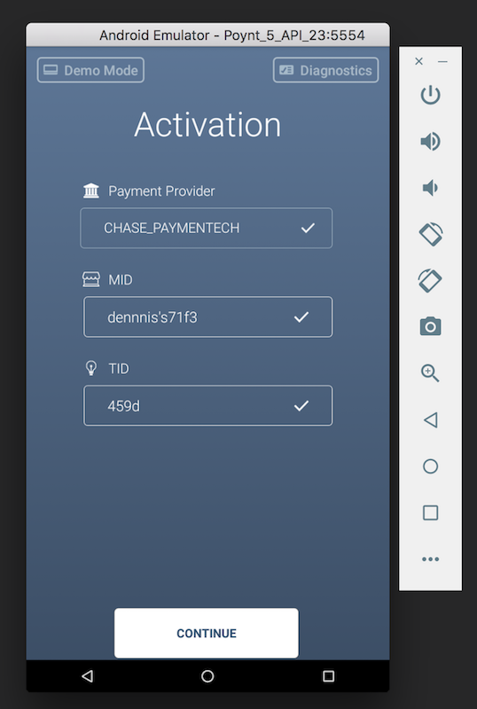

14) Enter MID and TID

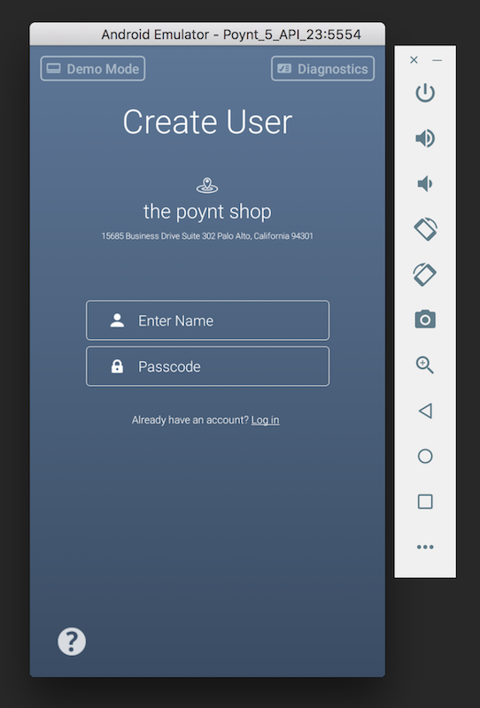

15) Create a new user if applicable or click "Log in" if you have existing users

16) Tap the Home button, select "Poynt Launcher" and tap on **ALWAYS**

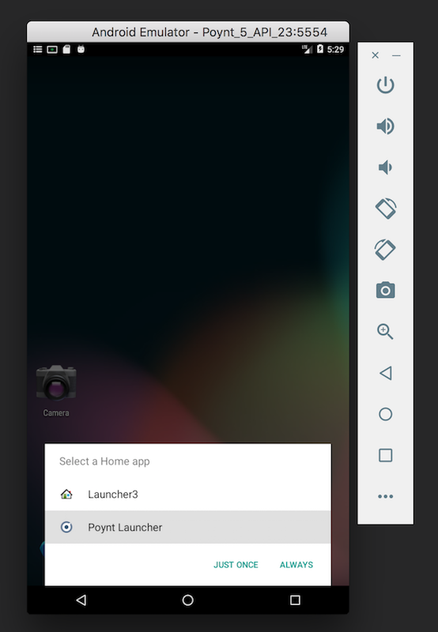

Your Emulator is set up!