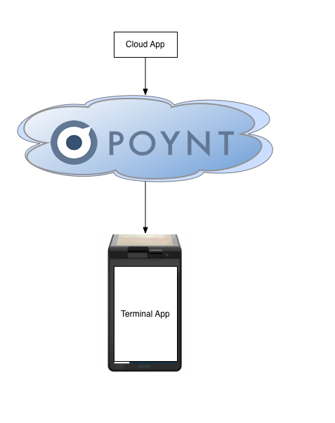

## Poynt Cloud Message  

Poynt Cloud Message (PCM) is Poynt's solution push notifications from the cloud to your applications running on the Poynt Smart Terminal.  This tutorial will explain the various components in PCM and describe how developers can send messages through PCM to their applications.

### Prerequisites

This tutorial assumes that you are proficient at development in:

1. Python
2. Android

## Overview

The main purpose of PCM is to allow developers to easily send push notifications to their application running on the Poynt Smart Terminal with minimal effort.

<center>

</center>

Developers will need to build two components:

1. A sending application that interact with the PCM REST API.
2. An Android application running on the Poynt Smart Terminal.

## Sending Mesages

To send a message through PCM, you will need two set of information:

1. The businessId + storeId where you want to send your message to.
2. Your terminal application's package and broadcast receiver class name that will be listening for the message.

We will be create a simple Python application that `POST` the message to Poynt.  This implementation is based on the [Poynt Python example](https://github.com/poynt/python-sample).  Please fork/clone it as we will need to modify it for this exercise.

Clone the repository and edit the `src/PoyntAPI.py` file.  Add the following function to the PoyntAPI class:

```
    def sendCloudMessage(self, businessId, storeId, packageName, className, data):
        pcmUrl = self.apiHost + "/cloudMessages"
        cloudMessage = {
            "businessId": businessId,
            "storeId": storeId,
            "ttl": 500,
            "recipient": {
                "className": className,
                "packageName": packageName
            },
            "data": data
        }
        code, jsonObj = self._sendPostRequest(pcmUrl, json.dumps(cloudMessage), {}, {})
        if code == requests.codes.accepted:
            print "Successfully sent cloud message."
```
Then in the `main` function near the end of the file, add the line after teh `poyntAPI.getAccessToken()` call:

```
poyntAPI.sendCloudMessage(BUSINESS_ID, STORE_ID, "com.my.android.package", "com.my.android.package.MyBroadcastReceiverClass", "Hello from the cloud.")
```
(For easier debugging, you can remove other lines inside the if block under the `poyntAPI.getAccessToken()` call)

This will cause the message to be routed to the `com.my.android.package.MyBroadcastReceiverClass` class in your terminal application.

Test your python code by executing `python src/PoyntAPI.py`.

## Receiving Messages

In order to receive messages your terminal application must have a broadcast receiver created with the matching package/class name as specified in the previous section.  Also, your receiver must be registered with the correct intent and category.  In your `AndroidManifest.xml` file, add your receiver to your application like so:

```
        <receiver
            android:name="com.my.android.package.MyBroadcastReceiver"
            android:enabled="true"
            android:exported="true">
            <intent-filter>
                <action android:name="poynt.intent.action.CLOUD_MESSAGE_RECEIVED" />
                <category android:name="poynt.category.CLOUD_MESSAGE" />
            </intent-filter>
        </receiver>
```

Your broadcast receiver class should look something like this:

```
public class MyBroadcastReceiver extends BroadcastReceiver {
    public MyBroadcastReceiver() {
    }

    @Override
    public void onReceive(Context context, Intent intent) {
        Log.d("MyBroadcastReceiver", "Got cloud Message: " + intent.getStringExtra(Intents
                .INTENT_EXTRA_CLOUD_MESSAGE_BODY));
    }
}
```

The message sent from the cloud will be put int the intent extra named `INTENT_EXTRA_CLOUD_MESSAGE_BODY`.  Compile and redeploy your android application with the above receiver.  Re-run the python example from the previous step.  You should see that your receiver printed out the message you sent.

## FAQ

### Does PCM guarantee message delivery?
No, PCM will hold your message for up to the time specified via the `ttl` parameter of your message.  If, for whatever reason, the Poynt Terminal is offline longer than that period of time, your message will be not be delivered.

### Does PCM guarantee at MOST once delivery?
Yes, PCM only deliver your message once so you do not need to have dedup logic.

### Does PCM guarantee ordered message delivery?
No.  While most of the time, messages will arrive in the order that they were sent, there are a very small chance that your messages will arrive out of order.  Your application logic must take into account for such a scenario.

### How fast will be message be delivered from the cloud?
A number of conditions (network conditions)can impact how fast your message will be delivered to your application. While most messages will be delivered in real time if the Poynt Terminal is online, your application logic must take into account delays in message delivery.

### What is the max mesage time to live?
When sending your message, you can specify a time to live (ttl) parameter for your message in seconds.  PCM will not deliver the message if the ttl time have passed.  The maximum value for the ttl parameter is 2419200 (4 weeks = 4 * 7 * 24 * 60 * 60 seconds)

### Can I overwrite a previously sent message?
PCM message have a parameter called `collapseKey`. When specified, this key becomes the unique identifier of a message.  If you send two PCM message with the same collapseKey, and assuming the first message have not yet been delivered, then the second message will overwrite the first message.

### What is the maximum message size that I can send?
PCM messages payload (i.e. the `data` element) can be up to 4096 bytes long.

### Why is my application not getting the cloud message I am sending?
Please refer to [our developer discussion board] (https://discuss.poynt.net/t/is-it-required-to-register-a-terminal-app-before-testing-poynt-cloud-messaging/206/15).