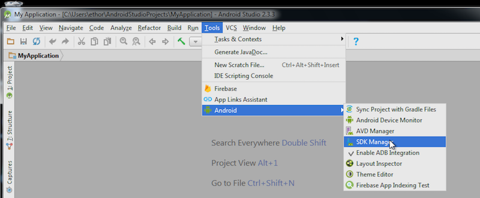
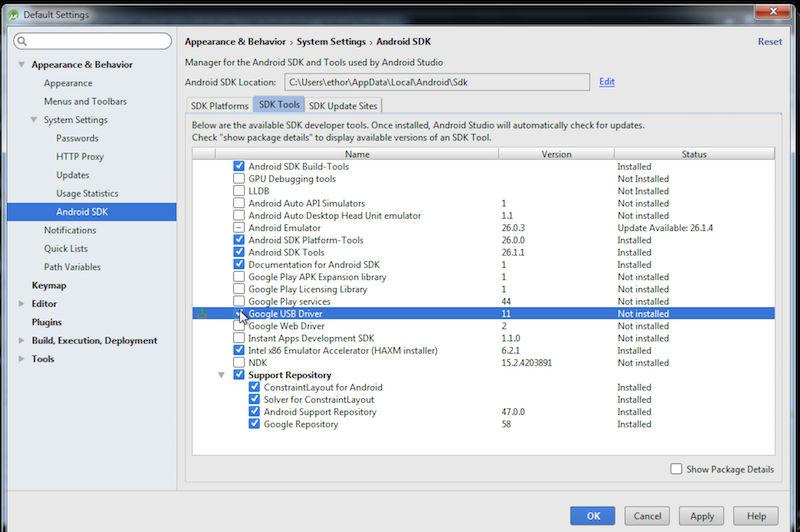
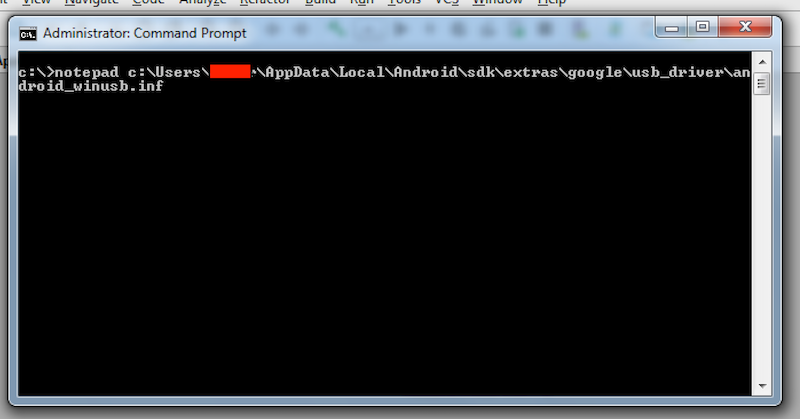
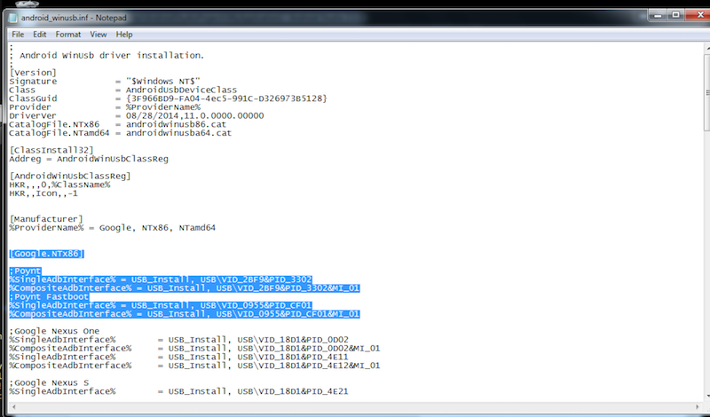
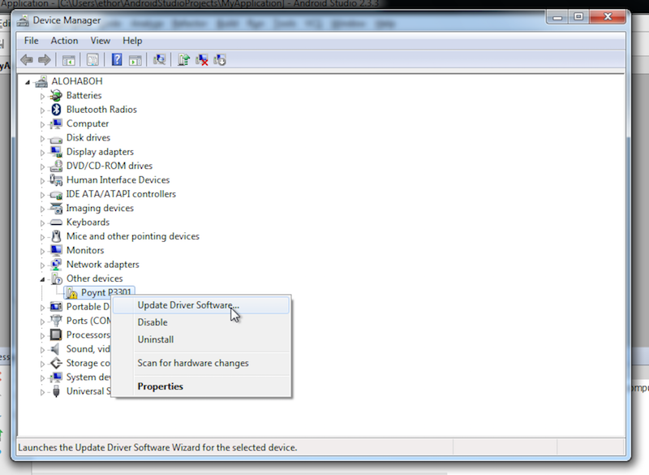
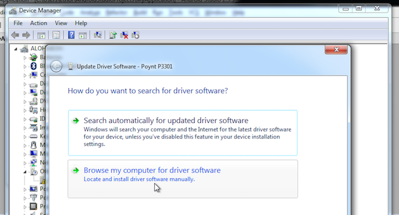
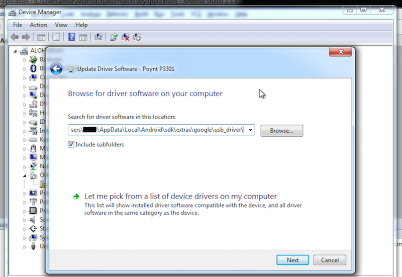
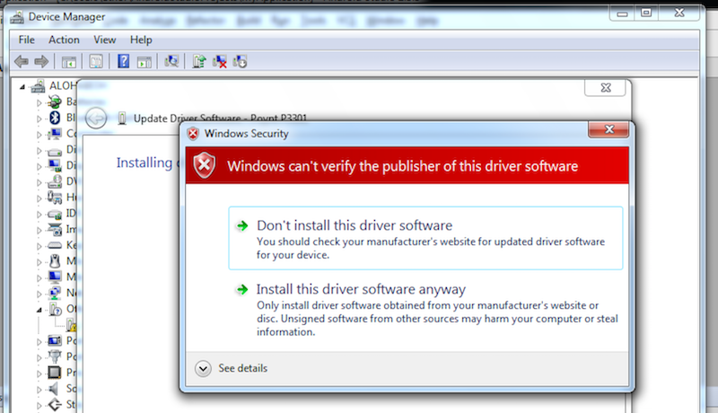
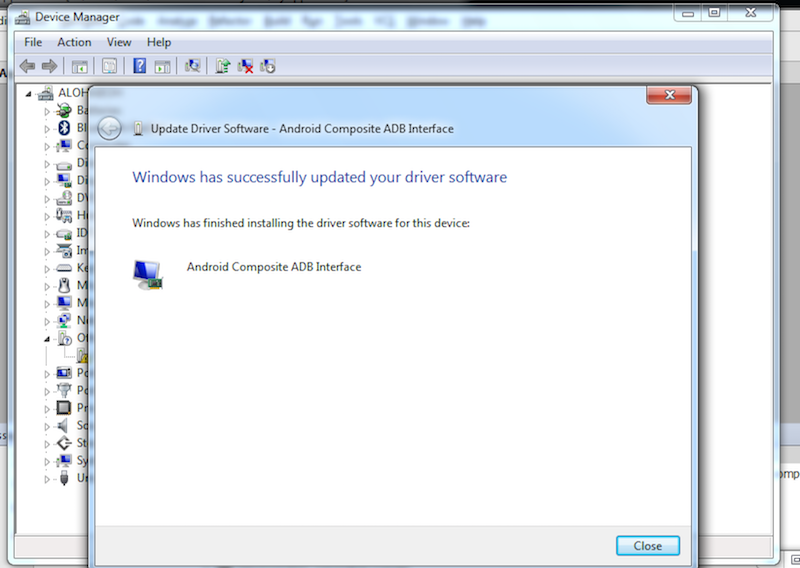
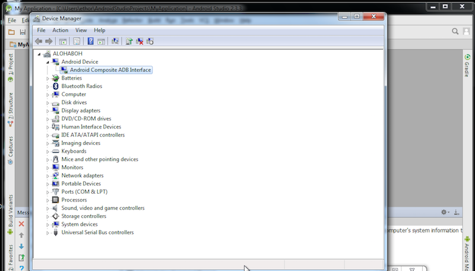

	
<strong>WARNING:</strong> This change is irreversible! Putting a production terminal into developer mode will disable terminal's ability to process real payments.
	

Once you receive your Poynt Developer Unit, you'll want to put your Poynt device into `Developer-Mode`.
This puts the device into a state that allows you to install your development APKs on the device.

## Pre-requisites

1. Android SDK with android-api 19 (Kitkat) installed on your development machine
2. Poynt Developer Unit

## Installation

1. Put your device into fastboot mode by holding the **power** and **volume up** button while the device is powered off. For more information about what fastboot does, see: [http://elinux.org/Android_Fastboot](http://elinux.org/Android_Fastboot)
	

	
	

2. Select **Fastboot Protocol** from the fastboot menu (press **volume down** button then **power** button). Screen will flicker and return to fastboot menu.
	

	
	

3. Make sure you have the <a href="https://developer.android.com/sdk/installing/index.html?pkg=tools">Android SDK tools</a> installed on your computer. You're going to need the `fastboot` command. Ensure your device is properly connected via a micro USB cable.

### For Windows Users

In Android Studio go to SDK Manager and install Google USB Driver.

Open android_winusb.inf in Notepad

Add the following configuration block to the **[Google.NTamd64]** and **[Google.NTx86]** sections and save the file.

~~~
;Poynt
%SingleAdbInterface% = USB_Install, USB\VID_2BF9&PID_3302
%CompositeAdbInterface% = USB_Install, USB\VID_2BF9&PID_3302&MI_01

;Poynt Fastboot
%SingleAdbInterface% = USB_Install, USB\VID_0955&PID_CF01
%CompositeAdbInterface% = USB_Install, USB\VID_0955&PID_CF01&MI_01
~~~

Connect Poynt to your PC using a micro-USB cable (not included with the devkit), open Device Manager, right click on Poynt and select **Update Driver Software**.

Select **Browse my computer..**

Browse to **C:\Users\\{username}\AppData\Local\Android\sdk\extras\google\usb_driver\\** and click Next.

Poynt driver is unsigned, so Windows will display a warning, select **Install this driver software anyway**.

You should see a success confirmation on the next screen, and Device Manager will show a new **Android Composite ADB Interface**

You should be able to see Poynt by running `adb devices` in command line (Note: `adb` and `fastboot` executables are located in `C:\Users\{username}\AppData\Local\Android\sdk\platform-tools\`).

Note: the same steps may need to be repeated for Windows to recognize when the terminal is the fastboot mode.

### Windows 10 Users

If are on Windows 10 you may encounter the following error:

Windows encountered a problem installing the driver software for your device.
Windows found driver software for your device but encoutered an error while attempting to install it.
The hash for the file is not present in the specified catalog file. The file is likely corrupt or the victim of tampering.

To proceed you will need to disable Device Driver Signing (please refer to [this](https://www.maketecheasier.com/install-unsigned-drivers-windows10/)) and re-do the steps above.

### For Mac OS X/Linux Users
Add `{SDK_LOCATION}\sdk\platform-tools` to your PATH environmental variable. To find out your Android SDK location, open Android Studio, Go to Android Studio->Preference->System Settings->Android SDK.

On some Linux distributions, you may be able to install Android SDK tools with _apt-get_{:.italic} command:
`apt-get install android-tools-adb android-tools-fastboot`

Ensure your device is properly connected via USB by running `fastboot devices` command on your host machine.

If your host machine runs on Linux and does not recognize the device please follow the instructions starting at Step 3 in this [Android User Guide](http://developer.android.com/tools/device.html#setting-up). You can find out the **vendor id**, by running `lsusb` in the Terminal window.

If your are unable to see the device after following the steps above, run the following command:

`echo "0x2BF9" >> ~/.android/adb_usb.ini`

#### Additional step for Linux
Add line:

`SUBSYSTEM=="usb", ATTR{idVendor}=="2bf9", MODE="0664", GROUP="plugdev" # Poynt`

to _/etc/udev/rules.d/51-android.rules_{:.italic}

## Continue Installation

1. Run the command to initiate the developer mode process: `fastboot oem developer`
	

	
	

2. Read the instructions on the Poynt Terminal, press the volume down button to move selection to `Enter developer mode` and Press the Power button to select. At this point your device will clear its cache and the device state in the bootloader screen should show `Unlocked` or `Developer mode`.

3. Reboot your device.
	

	
	

4. <a href="/developer/setup/activate-poynt-terminal.html">Activate your Poynt terminal</a>. Note: If you've previously activated your device, you can reuse your test MID and TIDs to reactivate.

&nbsp;

## Unlocking Poynt5

1. shutdown the device
2. start by holding barcode button (left side key) + pull down power switch at the same time until you see the bootloader menu.
3. on screen select fastboot by using the barcode button and home button to select `unlock on fastboot: you need adb version >= 1.0.36`
4. execute `fastboot flashing unlock`
5. select OK, with Barcode button (button, on the left side of the terminal)
6. After unlock process finished execute `fastboot reboot`
7. If reboot does not get initiated just use the power switch to initiate reboot

<!-- feedback widget -->

