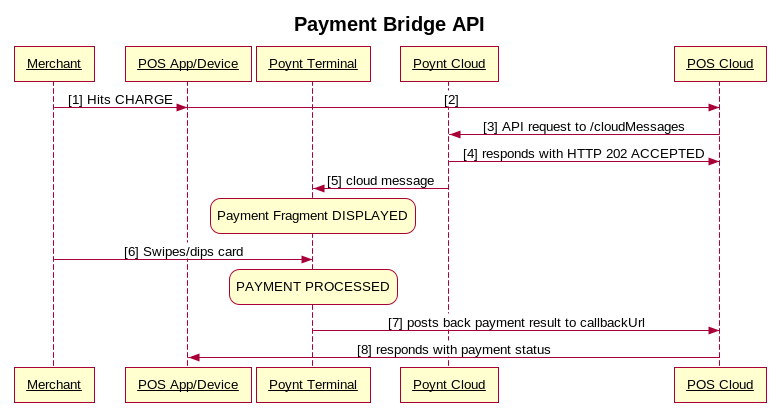
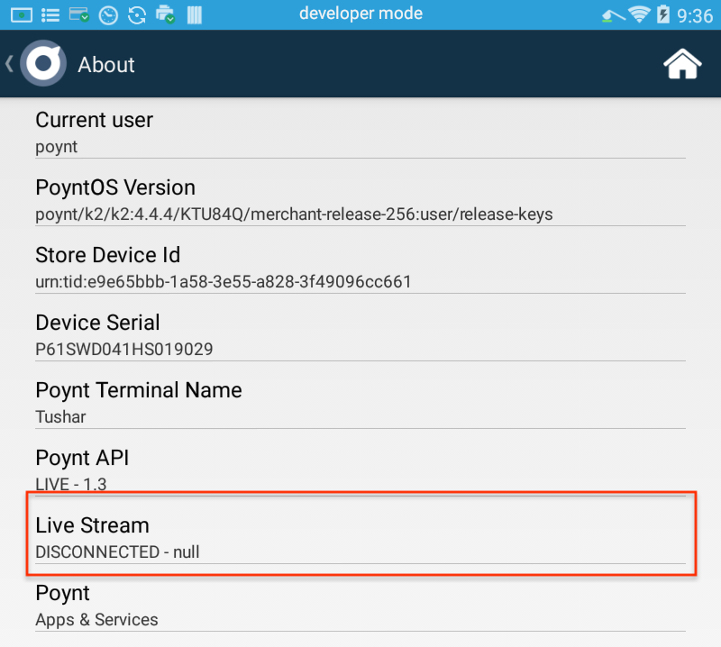
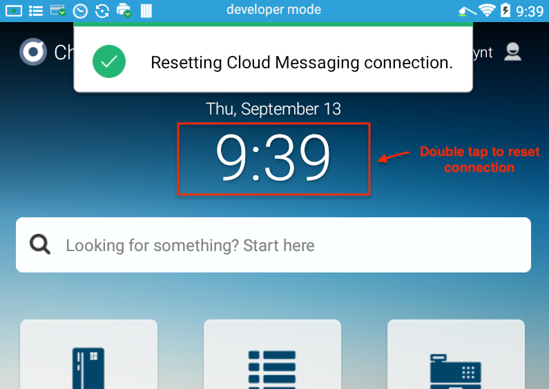
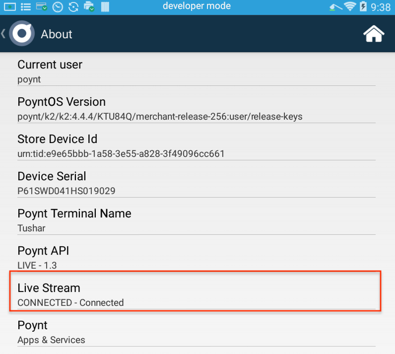

Note: While this API is currently availalbe at no charge, Poynt reserves the right to introduce an API usage fee in the future.
 

&nbsp;

Payment Bridge API provides a way for external systems (e.g. web-based point-of-sale systems) to start a transaction flow on Poynt Terminal using Poynt cloud APIs.

Here is how it works:

1. External System [sends a Poynt Cloud Message](../onterminal/poynt-cloud-messages.html) with a payment request containing business id, store id and terminal id of the merchant
2. Poynt Cloud authorizes the caller and forwards the message to the corresponding merchant terminal
3. Poynt Payment Bridge receives the incoming message and starts the payment flow on the device.

# Prerequites:

1. [Create a developer account and activate your developer terminal](../setup/activate-poynt-terminal.html). (Note: if you don't have a developer unit you can use [emulator](../setup/setup-poyntos.html))
2. Generate API credentials (i.e. appId and private key) by [creating an app](../cloud/integrating-with-poynt-cloud-apis.html#create-app). Make sure it has "Cloud Messages" WRITE permission
3. Use "Merchant Login Url" of your app to [Authorize one of your test merchants](../cloud/integrating-with-poynt-cloud-apis.html#authorize-merchant)

# Payment Bridge Message Flow

# Request Message Format

**COMMON PARAMETERS FOR ALL MESSAGES**

* **storeId**, **businessId** and **deviceId** determine which terminal receives the request
* **ttl** If the Poynt server was unable to deliver the message to the terminal, after TTL (in seconds) is reached the request will be discarded 
* **data** contains payment request options

**COMMON "data" PARAMETERS**

* **callbackUrl** where you will receive a callback (HTTP POST) with [Payment](http://poynt.github.io/developer/javadoc/co/poynt/os/model/Payment.html) object. Payment objects acts as the container for transaction response. If the transaction only had 1 tender, the Payment object will have a list with a single [Transaction](https://poynt.com/docs/api/#model-transaction) object; in case of a split tender it will contain the list of 2 or ore transactions.
* **custom-http-header**: optional custom header name and value that will be set by Poynt in the callback HTTP request (e.g. you can use this to pass an authorization token)

&nbsp;

## Sale

**"data" PARAMETERS**
* **payment** serialized payment object. The payment object contains [options](../overview/poynt-payment-fragments.html#parameters) to configure the payment session. For the list of supported options please refer to [this article](../overview/poynt-payment-fragments.html#parameters).

## Refund

**"data" PARAMETERS**
* **referenceId** unique id returned in the postback response
* **transactionId** id of the SALE or CAPTURE to refund
* **action** should be set to "refund"

<!--
e.g. `{"ttl": 500, "businessId": "d9f90edd-53d0-49ed-9589-22d92b9bfda4", "storeId": "8a545d2b-e5d8-4cf0-b766-0fe32870813b", "deviceId": "urn:tid:9a645d2b-e3c8-7cf0-d766-9fe32870813b", "data": "{\"action\":\"sale\", \"purchaseAmount\": 1000, \"tipAmount\": 100, \"currency\":\"USD\", \"referenceId\":\"ABC1234\"}"}`

* **storeId** and **businessId** of the merchant (and optionally **deviceId**. If not included the payment request will be sent to all terminals in the store).
* data is the actual payload:
  * Format: `{"action":"sale", "purchaseAmount": 1000, "tipAmount": 100, "currency":"USD", "referenceId":”ABC1234”, “callbackUrl”: “-urlencoded-url-"}`
  * **action**: authorize, sale, void, refund, non-referenced-credit
  * **purchaseAmount**: transaction amount (excluding tip)
  * **tipAmount**: tip amount if enabled for merchant
  * **currency**: 3 digit currency value (e.g. "USD")
  * **referenceId**: external referenceId that you can use to correlate transactions across systems
  * **orderId**: order id of a previously created order or order that will be created after the payment
  * **callbackUrl**: where you will receive a callback (HTTP POST) with [Poynt Payment object](http://poynt.github.io/developer/javadoc/co/poynt/os/model/Payment.html)
  * **transactionId**: transactionId to use for void, refund operations
  * **custom-http-header**: Custom HTTP header name and value that will be set by Poynt in the callback request
  * **skipReceiptScreen**: value of `true` will force the receipt options screen to be skipped
  * **debit**: value of `true` will default payment method to debit
-->

# Callback

Callback allows the external system to get notified when the payment transaction requested is processed. The terminal will use the callback url provided in the request to send the response via HTTP POST:

`{"referenceId”:”<your-reference-id>","status":”CANCELED or PROCESSED”, “transactions”:[{<processed-transaction>}]}`

Example of a canceled payment:

Example response for a processed transaction (could be either success/approval or failure/decline):

POSTBACK RETRY LOGIC  The terminal waits 3 seconds to get HTTP 200 from the postback listener. If your listener fails to repond within that timeframe the terminal will attempt to re-deliver 5 and 10 seconds later.

&nbsp;

IMPORTANT! Since the postback payload is a serialized version of the Payment object and from time to time we may add new parameters, it is important that you do not use strict validation while parsing the payload, which means ignoring unknown parameters.

&nbsp;

# Terminal Connectivity

Terminals maintain a persistent connection to the Poynt cloud but from time to time the connection may get dropped. By default, terminals send a ping message to check if the connection is active every 5 minutes. However you can change the timeout to be more agressive to ensure that the connection does not get dropped by sending the following message to the terminal:

The message does not use a callback url as it does not require a postback.

## FAQ
**Q: The body in the callback request is gzip compressed. How can I disable the compression?** 
A: Go to Developer Preferences > Poynt API. Toggle the switch for ENABLE HTTP COMPRESSION and tap SAVE. Check [Dev FAQ](overview/developer-faqs.html) page for instructions on accessing Developer Preferences. 

**Q: My request fails with HTTP 401** 
A: This indicates that your appId does not have permission to send cloud messages to the merchant's terminals. Please refer to Step 3 of **Prerequires**.

**Q: My API request returns HTTP 202 however the payment fragment does not come up on the terminal** 
A: First check the logcat to see if the message even makes it to the terminal `adb logcat -v time | grep -i pcm`. If you don't see the messages being logged it's likely because the connection between the terminal and the cloud was terminated. You can verify that by checking Poynt Settings: 
 
To reconnect you can double tap on the clock on the launcher: 
 
After that you can confirm that the connection has been re-established: 
 

Note: Please note that if you are using an emulator you need to check that the co.poynt.cloudmessaging package has been installed.

<!-- feedback widget -->

